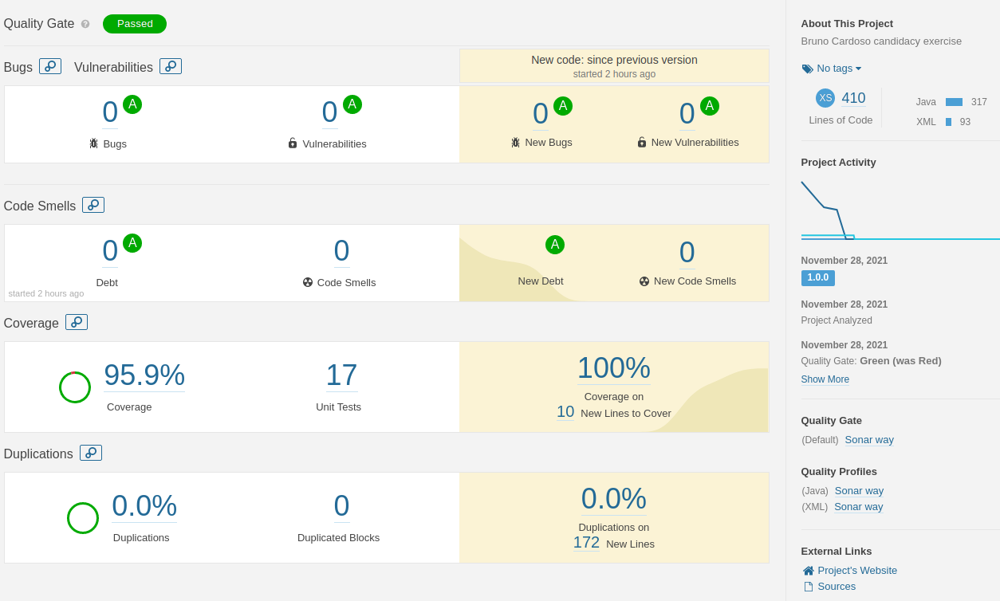

## Build
In the project's root directory, run the command below to create the **jar**
> mvn clean package

The **_target/brunocardoso-{version}.jar_** file will be generated.

---

## Deployment
In the project's root directory, run the command below to create/raise the docker:
> docker-compose up -d --build

The application becomes operational, accessible by default via the URL `http://{ip}:8080/*`

---

## Configure ports

### Application port 

By default the application port is **8080**.  
If necessary, change the project's **_src/main/resources/application.properties_** file, on the line:
```
server.port=8080
```

Then go to the **_docker-compose.yml_** file in the project's root directory, and replace the application port, configured in **{application port}** in the line:

```yaml
ports:
      - "8080:{application port}"
```

---

### Container port
By default the docker port is **8080**.  
In case you need to change it, go to the **_docker-compose.yml_** file in the project's root directory, and replace the port that tunnels with the 8080, configured in the **{application tunnel}** on the line:  

```yaml
ports:
      - "{application port}:8080"
```

---

## Test RESTFul services

Import to [Postman](https://www.postman.com/) the file `examples/BrunoCardoso.postman_collection.json`.  
___

## This application has been refactored based on the SonarQube 7.5 report.

